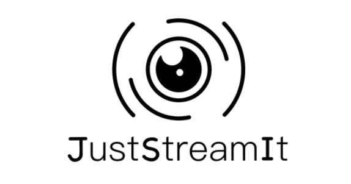

# Projet 6 : Développez une interface utilisateur pour une application web en python




## Sommaire

+ [Objectif du projet ](#Objectif)
+ [Installation du projet](#Installation)
+ [Installation des packages](#Packages)
+ [Le fichier .gitignore](#gitignore)
+ [prerequis](#Prerequis)
+ [Lancement](#Lancement)

## Objectif

Le projet consiste à créer une page HTML pour l'association JustStreamIt. 
Cette association est connue pour répertorier et classer des films suivant différentes informations et catégories.

La page doit pouvoir afficher les catégories de films dans des caroussels à l'image du site "Netlix". 

L'interface doit comprendre les zones suivantes :
 - Un bloc "Meilleur film", affichant la jaquette du film, le résumé, ainsi qu'un bouton permettant d'afficher les différentes informations.
 - Un bloc "Films les mieux notés", affichant les jaquettes des 7 meilleurs films toutes catégories confondues. Des boutons doivent permettre de faire défiler les films de gauche à droite, et chaque clic sur une jaquette doit afficher les informations du film dans une fenêtre.
 - 3 autres blocs suivant le schéma du bloc "Films les mieux notés", les catégories étant au choix du développeur.

Le projet utilise les languages HTML, CSS et Javascript. La page se connecte à une API afin de récupérer les différentes informations.

Le site fonctionne sur les 3 navigateurs les plus utilisés actuellement.

## Installation
  
  1- Télécharger et installer la dernière version de Python.
  Pour ma part j'ai installé la version python 3.10.6
		 
2 - Depuis votre terminal sous windows ( cmd )  

Verifiez que vous avez pip installer sur la machine
pour cela lancer la commande 

```pip --help```

- Créer votre dossier projet sous windows
	     
```
mkdir < MyProject06 > 
```
où MyProject06 est le nom de votre projet,
placez-vous dans le repertoire projet
```
cd < MyProject06 > 
```
Créer votre environnement virtuel
```
pip -m venv < myenv > 
```
Où myenv est le nom pour votre environnement virtuel.
Activez votre environnement virtuel.
```
cd < myenv\scripts> 
activate.bat
```

## gitignore

- Exclure l'environnement virtuel des commits sur le serveur distant 
	
Créez le fichier .gitignore à la racine de votre projet:   

```~\MyProject06\.gitignore ```

Editez le fichier .gitignore et ajouter les fichiers et repertoire que vous souhaitez exclure

## Prérequis

Afin de pouvoir afficher les différentes informations de chaque film, vous devez installer l'API locale ```OCMovies-API```, disponible à cette adresse : https://github.com/OpenClassrooms-Student-Center/OCMovies-API-EN-FR
Le fichier README donne toutes les informations pour l'installer sur différents types d'OS.

## Lancement

Copier dans un dossier local les différents dossiers et fichiers contenus dans le depot distant, démarrer l'API via une invite de commande comme indiquer dans le README. Enfin faites un double-clic sur le fichier ```index.html```.
